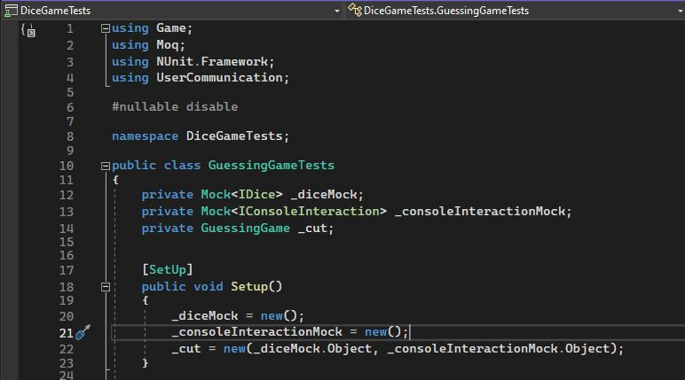
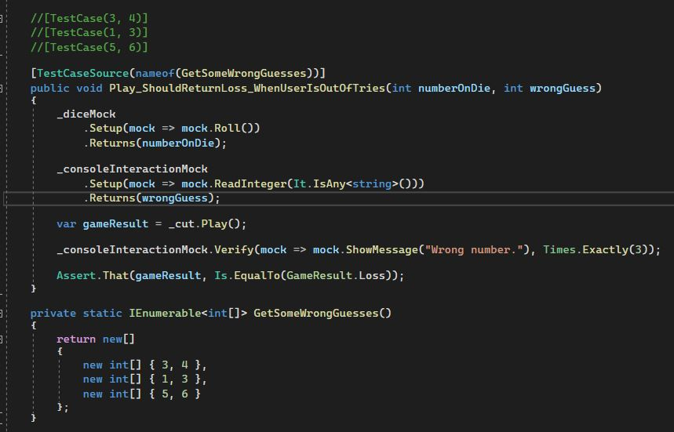
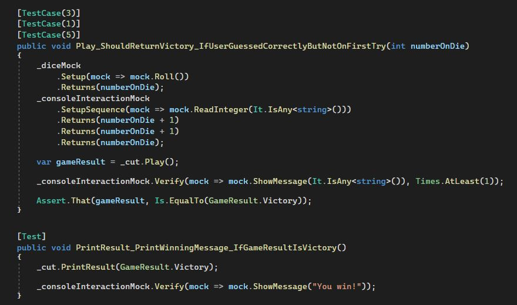

# Unit Tests Dice Games
This one of several exercises to practice unit testing in C#. The application itself is a dice guessing game. The user has 3 attempts to guess what number was "rolled" for a 6 sided die. I refrained from adding the code for the game itself as the point of this repository is to display knowledge in unit testing.  

After all necessary packages were installed, and a class library was created, it was then time to create and setup the specific class under test(cut), which in this case is the GuessingGame class. I made use of the preprocessor directive to tell the compiler not to warn me about the fields needing to "contain non-null values when exiting constructor", as this is being used for unit testing and our "constructor" will be in our Setup method.

From then on it was about creating the tests. It is a relatively easy process, more time consuming than anything else, but necessary to prevent code degradation and the accrument of code debt.
Below are a few tests, one of them not included in the GuessingGame.cs as it is a TestCaseSource that isn't needed for this scenario but, that I wanted to practice. Other tests can be found in GuessingGameTest.cs  

  

